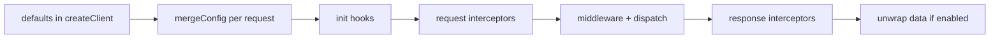
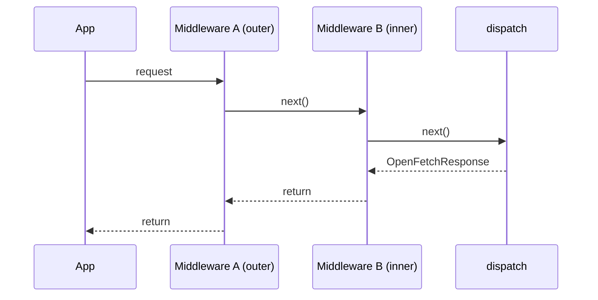

# Visual guide (hands-on)

This page is a practical, visual-first walkthrough for **every major openFetch capability**.  
If you do not like long reading, follow each section as:

1) **Use it now** (copy/paste snippet)  
2) **What happens behind the scenes** (short flow)

<FeatureFlowCards />

## 1) Create client instances and defaults

### Use it now

```ts
import { createClient } from "@hamdymohamedak/openfetch";

const api = createClient({
  baseURL: "https://api.example.com",
  headers: { Authorization: "Bearer <token>" },
  timeout: 10_000,
  unwrapResponse: true,
});

const users = await api.get("/v1/users");
```

### Behind the scenes



---

## 2) HTTP methods + request config

### Use it now

```ts
const created = await api.post("/v1/users", { name: "Lina" });
const updated = await api.put("/v1/users/12", { name: "Lina M" });
const removed = await api.delete("/v1/users/12");
```

### Behind the scenes

- Plain objects become JSON automatically when `content-type` is missing.
- `baseURL`, `params`, headers, timeout, and signal are merged into one final request.

---

## 3) Interceptors (request + response)

### Use it now

```ts
api.interceptors.request.use((cfg) => {
  cfg.headers = { ...(cfg.headers ?? {}), "x-trace-id": crypto.randomUUID() };
  return cfg;
});

api.interceptors.response.use((res) => {
  console.log("status", res.status);
  return res;
});
```

### Behind the scenes

- Request interceptors run **LIFO** (last registered first).
- Response interceptors run **FIFO** (first registered first).

---

## 4) Middleware pipeline

### Use it now

```ts
api.use(async (ctx, next) => {
  const start = Date.now();
  await next();
  console.log("request took", Date.now() - start, "ms");
});
```

### Behind the scenes



---

## 5) Retry (backoff + lifecycle hooks)

### Use it now

```ts
import { retry } from "@hamdymohamedak/openfetch/plugins";

api.use(
  retry({
    attempts: 3,
    baseDelayMs: 250,
    timeoutTotalMs: 8_000,
    onBeforeRetry: async (_ctx, meta) => {
      console.log("retrying attempt", meta.attempt + 1);
    },
  })
);
```

### Behind the scenes

- Retry re-runs `next()`; middleware below retry runs once **per attempt**.
- For POST retries (when enabled), openFetch can auto-add stable `Idempotency-Key`.
- `timeoutTotalMs` uses monotonic time to avoid clock-skew issues.

---

## 6) Timeout and cancelation

### Use it now

```ts
import { timeout } from "@hamdymohamedak/openfetch/plugins";

api.use(timeout(4_000));

const ac = new AbortController();
setTimeout(() => ac.abort(), 500);
await api.get("/slow-endpoint", { signal: ac.signal });
```

### Behind the scenes

- Internal timeout abort -> `ERR_TIMEOUT`.
- External `AbortController` abort -> `ERR_CANCELED`.

---

## 7) In-memory cache (TTL + SWR + coalescing)

### Use it now

```ts
import { MemoryCacheStore, createCacheMiddleware } from "@hamdymohamedak/openfetch";

const store = new MemoryCacheStore({ maxEntries: 1000 });
api.use(
  createCacheMiddleware(store, {
    ttlMs: 60_000,
    staleWhileRevalidateMs: 10_000,
    varyHeaderNames: ["authorization", "cookie"],
  })
);
```

### Behind the scenes

- Cache key is `METHOD + fullUrl` (+ vary headers).
- Concurrent misses for same key are coalesced into one origin hit.
- Cached response data is cloned to avoid mutation leaks between consumers.

---

## 8) Debug logging (safe by default)

### Use it now

```ts
import { debug } from "@hamdymohamedak/openfetch/plugins";

api.use(
  debug({
    includeRequestHeaders: true,
    maskHeaders: ["authorization", "cookie"],
    maskStrategy: "partial",
  })
);
```

### Behind the scenes

- Sensitive URL query keys are redacted by default.
- Header masking can be `full`, `partial`, or stable hash fingerprints.

---

## 9) Error model + guards

### Use it now

```ts
import { isOpenFetchError, isHTTPError, isTimeoutError } from "@hamdymohamedak/openfetch";

try {
  await api.get("/v1/protected");
} catch (e) {
  if (isOpenFetchError(e)) {
    console.log(e.code); // ERR_BAD_RESPONSE / ERR_TIMEOUT / ERR_NETWORK ...
    console.log(e.toShape());
  }
  if (isHTTPError(e)) console.log("HTTP failure");
  if (isTimeoutError(e)) console.log("timeout");
}
```

### Behind the scenes

- `OpenFetchError` provides structured metadata and safe serialization helpers.
- `SchemaValidationError` is separate for JSON schema mismatches.

---

## 10) JSON schema validation (Standard Schema)

### Use it now

```ts
const userSchema = {
  "~standard": {
    version: 1,
    vendor: "demo",
    validate(value: unknown) {
      if (typeof value === "object" && value && "id" in value) return { value };
      return { issues: [{ message: "Missing id" }] };
    },
  },
};

const user = await api.get("/v1/user/me", {
  unwrapResponse: true,
  jsonSchema: userSchema,
});
```

### Behind the scenes

- Validation runs after successful HTTP status and JSON parse.
- Invalid shape throws `SchemaValidationError` with issues list.

---

## 11) Fluent API (lazy chain + memo)

### Use it now

```ts
import { createFluentClient } from "@hamdymohamedak/openfetch/sugar";

const fluent = createFluentClient({ baseURL: "https://api.example.com" });

const profile = await fluent("/v1/profile").get().json();
const raw = await fluent("/v1/export").get().raw();

const memoed = fluent("/v1/me").get().memo();
const asJson = await memoed.json();
const asText = await memoed.text();
```

### Behind the scenes

- Each terminal (`.json()`, `.text()`, `.raw()`) triggers a new request unless `.memo()` is used.
- `.raw()` returns native `Response` without openFetch body parse.

---

## 12) Progress events (upload/download)

### Use it now

```ts
await api.post("/v1/upload", fileStream, {
  onUploadProgress: (e) => console.log("upload", e.percent),
});

await api.get("/v1/big-report", {
  onDownloadProgress: (e) => console.log("download", e.transferred, e.total),
});
```

### Behind the scenes

- openFetch wraps request/response streams to emit progress safely.
- For unknown `Content-Length`, percent can be `null`.

---

## 13) Security helpers

### Use it now

```ts
import { assertSafeHttpUrl } from "@hamdymohamedak/openfetch";

assertSafeHttpUrl("https://api.example.com");
// throws on localhost/private literal IPs when using http(s)
```

### Behind the scenes

- `assertSafeHttpUrl` blocks local/private literal IP targets.
- It is a guardrail, not a full DNS-rebinding firewall.

---

## 14) Subpath imports and bundle hygiene

### Use it now

```ts
import openFetch from "@hamdymohamedak/openfetch";
import { retry, timeout, debug } from "@hamdymohamedak/openfetch/plugins";
import { createFluentClient } from "@hamdymohamedak/openfetch/sugar";
```

### Behind the scenes

- Package exports are split so bundlers can tree-shake unused APIs.
- Runtime transport remains standard `fetch` (no XHR adapter).

---

## Build your own visual playground

If you want live docs demos (buttons + animated network timeline) in a product docs site, combine:

- this page (`visual-guide`) as concept map,
- [`debugging`](./debugging.md) for structured events,
- [`features-pipeline`](./features-pipeline.md) for execution order contracts.
